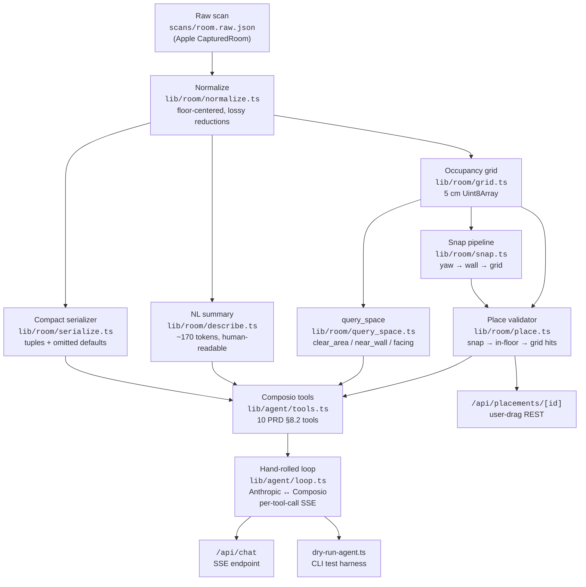
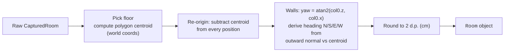
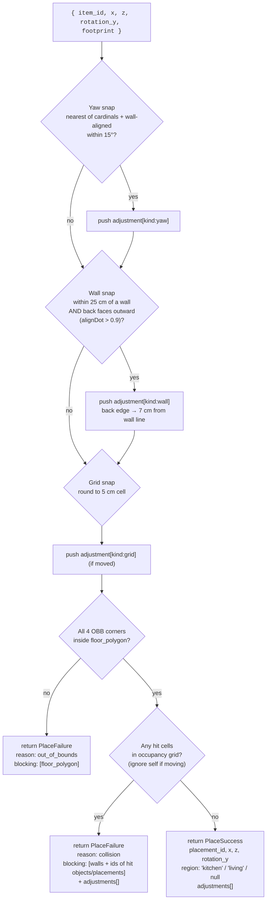
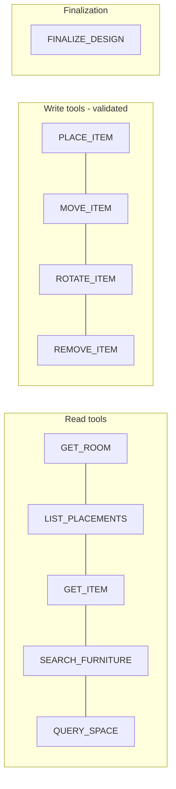

# Room → Agent Architecture

This doc describes the slice of soon2026 that turns a raw RoomPlan scan into something the agent can reason about, place furniture into, and query — i.e. everything between `scans/room.raw.json` and the chat SSE endpoint. It does not cover the iOS scanner upstream or the React render layer downstream.

## 1. Layer stack

Each layer only depends on the layer directly below it. Anything you swap out (e.g. plugging in a SAM-enriched object detector later) only touches its own layer's contract.



## 2. Step-by-step data flow

### 2.1 Ingestion (one-time per scan)

The raw scan has lots of clutter the LLM doesn't need: 16-float `simd_float4x4` transforms, completedEdges, coreModel blob, attribute objects, etc. Normalization is purely lossy reduction:



The output is the `Room` schema in [lib/room/normalize.ts](../lib/room/normalize.ts) — same field names as PRD §5.3, no surprises.

### 2.2 Agent context (one-time per session, prompt-cached)

On the first request, the system prompt assembles three text blocks, all marked with Anthropic's `cache_control: { type: 'ephemeral' }`:

| Block | Source | Purpose |
|---|---|---|
| Role + design principles | hardcoded in [loop.ts](../lib/agent/loop.ts) | "You are an interior designer's assistant…" |
| Schema doc + summary + JSON | [serialize.ts](../lib/room/serialize.ts) + [describe.ts](../lib/room/describe.ts) | What the room IS — both human paragraph and machine JSON |
| Tool definitions | Composio `tools.get(userId, { tools: [...] })` | What the agent can DO |

Combined budget for the demo room: **~1330 tokens** (1004 JSON + 173 NL summary + 154 schema doc). Subsequent turns hit the prompt cache and only pay for the new user message + tool-result tokens.

### 2.3 Per-turn loop

```mermaid
sequenceDiagram
  participant U as User
  participant API as /api/chat
  participant Loop as runAgentTurn
  participant Anthropic
  participant Composio
  participant Tools as Tool handlers<br/>(state mutators)

  U->>API: POST { message }
  API->>Loop: runAgentTurn(message, sseEmit)
  Loop->>Anthropic: messages.create (cached system + msg)
  Anthropic-->>Loop: stop_reason: tool_use
  loop while stop_reason == tool_use
    Loop->>API: emit tool_call (SSE)
    Loop->>Composio: tools.execute(slug, { userId, arguments })
    Composio->>Tools: handler(input)
    Tools-->>Composio: { data, error, successful }
    Composio-->>Loop: result.data
    Loop->>API: emit tool_result (SSE)
    Loop->>Anthropic: messages.create (with tool_result)
    Anthropic-->>Loop: next response
  end
  Loop->>API: emit assistant_message (SSE)
  API-->>U: closes stream
```

Two protections live in `runAgentTurn`:

- **Hard cap**: 12 tool-iteration max — kills runaway loops.
- **Per-item retry streak**: if `PLACE_ITEM` for the same `item_id` fails 3 times in a row, emit `loop_aborted` and stop. The agent has to ask the user.

## 3. Placement validation pipeline

This is the most important box and the one that gives the agent its "did it work?" signal. Every `place_item` / `move_item` / drag REST call funnels through `validatePlacement`:



### Why hard-fail with structured failure (not auto-retry)

The agent gets `blocking: [{ id, kind }]` on failure. It reads that and decides: pick a different spot, swap the item for a smaller one, or surface the conflict to the user. This is PRD §7.3 + §8.5 — agent agency over re-suggestion logic, plus it makes good demo theater (the tool-call sidebar shows the conflict and the agent narrating around it).

### Why auto-snap on success

Demo theater again. The agent passes "approximate" coords; we honor the intent and adjust. The `adjustments[]` array tells the agent *what* we did, so it can narrate accurately ("I placed the sofa with its back against the south wall…").

## 4. Tool surface — what the agent can ask & do



Yes — **placements are fully queryable**:

- After `PLACE_ITEM` succeeds it returns `placement_id`. That id stays stable for the rest of the session.
- `LIST_PLACEMENTS` returns every active placement with `{ id, catalog_item_id, x, z, rotation_y, dim }`.
- `GET_ITEM(catalog_item_id)` returns the full catalog record (name, brand, price, materials, description) — so given a placement, the agent can hydrate the catalog details on demand.
- `MOVE_ITEM` / `ROTATE_ITEM` / `REMOVE_ITEM` all take `placement_id`.
- The compact `Room` JSON in the system prompt also includes the **already-detected** objects from RoomPlan (table, fireplace, etc.) under `objects[]`. Those have ids too and are referenceable in `query_space` (e.g. `{ type: "facing", target_id: "table_a453648d" }`).

So the agent always has three referenceable categories of furniture by id:
1. **Detected, kept** (from the scan, in `room.objects`)
2. **Active placements** (added by the agent or user, in `state.placements`)
3. **Catalog items** (the things it can place, in `state.catalog`)

## 5. Plug-in points (future)

The schema is permissive enough that none of these break the agent contract:

| Future feature | Where it slots in | Adds |
|---|---|---|
| **SAM/YOLO enrichment** during scan | iOS pipeline, then a post-`normalize` enrichment step | Optional `material`, `color`, `secondary_label` on `NormalizedObject` |
| **Vibe RAG** for `SEARCH_FURNITURE` | `lib/agent/catalog.ts` | Pre-computed embeddings + cosine match (PRD §6.5) |
| **Multi-room** | `getSession` keyed by `room_id` instead of `demo_user` | A list of rooms; each placement scoped to a room |
| **Real vendor onboarding** | `data/furniture.json` → DB | Same `CatalogItem` schema, different storage |
| **Pre-built Composio toolkits** (Gmail, Notion) | `tools.get(userId, { toolkits: ['gmail'], tools: [...] })` | Adds `GMAIL_CREATE_DRAFT` etc. alongside the 10 custom tools |

The most interesting near-term plug-in is SAM enrichment: it runs on the AR frame buffer during scan, attaches semantic labels to each detected object, and writes them into the `attributes` array (already a `string[]` on `NormalizedObject`). The compact serializer + NL summary will pick them up automatically. No agent-side changes.

## 6. Verification checklist

| What | How |
|---|---|
| Room rep is sane | `npx tsx scripts/print-room-context.ts` — eyeball JSON + summary + token count |
| Snap + collision works | `npx tsx scripts/dry-run-place.ts` — 4 seeded cases (clear, wall-snap, on-object, OOB) |
| Agent loop end-to-end | `npx tsx scripts/dry-run-agent.ts "..."` — needs `ANTHROPIC_API_KEY` + `COMPOSIO_API_KEY` in env |
| SSE arrives per tool call | `curl -N -X POST localhost:3000/api/chat -d '{"message":"…"}'` after `npm run dev` |
| TypeScript clean | `npx tsc --noEmit` |
| Production build | `npx next build` |

## File map

| Layer | Files |
|---|---|
| Raw types & helpers | [lib/roomplan.ts](../lib/roomplan.ts) |
| Normalization | [lib/room/normalize.ts](../lib/room/normalize.ts) |
| LLM-facing rep | [lib/room/serialize.ts](../lib/room/serialize.ts), [lib/room/describe.ts](../lib/room/describe.ts) |
| Spatial primitives | [lib/room/segments.ts](../lib/room/segments.ts), [lib/room/regions.ts](../lib/room/regions.ts), [lib/room/grid.ts](../lib/room/grid.ts) |
| Snap & validate | [lib/room/snap.ts](../lib/room/snap.ts), [lib/room/place.ts](../lib/room/place.ts) |
| Spatial queries | [lib/room/query_space.ts](../lib/room/query_space.ts) |
| Catalog | [lib/agent/catalog.ts](../lib/agent/catalog.ts), [data/furniture.json](../data/furniture.json) |
| Session state | [lib/agent/state.ts](../lib/agent/state.ts) |
| Composio tools | [lib/agent/tools.ts](../lib/agent/tools.ts) |
| Agent loop | [lib/agent/loop.ts](../lib/agent/loop.ts) |
| HTTP routes | [app/api/chat/route.ts](../app/api/chat/route.ts), [app/api/placements/[id]/route.ts](../app/api/placements/[id]/route.ts) |
| Test harness | [scripts/print-room-context.ts](../scripts/print-room-context.ts), [scripts/dry-run-place.ts](../scripts/dry-run-place.ts), [scripts/dry-run-agent.ts](../scripts/dry-run-agent.ts), [scripts/spike-composio.ts](../scripts/spike-composio.ts) |
